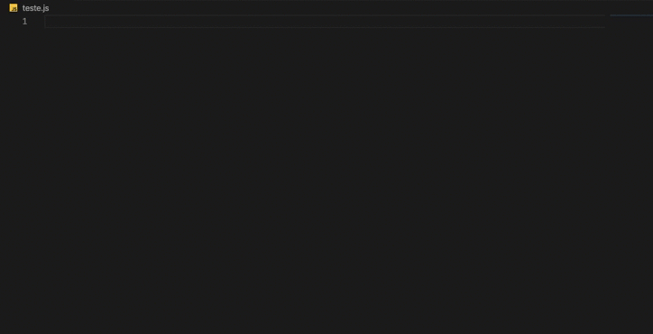

# 🚀 Rapicare Snippets 

Essa é uma extensão com vários snippets para facilitar o desenvolvimento de novas funcionalidades utilizando a arquitetura DDD (Domain Drive Design).

## 📝 Lista de Atalhos

- `rp-create` : Gera um useCase de create
- `rp-get` : Gera um useCase de get
- `rp-list` : Gera um useCase de list
- `rp-update`: Gera um useCase de update
- `rp-delete`: Gera um useCase de delete
- `rp-custom` : Gera um useCase de customizado
- `rp-repository` : Gera um repositorio
- `rp-mapper`: Gera um mapper

## Demostração

## Download

[Clique aqui](https://marketplace.visualstudio.com/items?itemName=gabrielrabelo.rapicaresnippet)

## Autor

👨🏻‍💻 [Gabriel Rabelo](https://github.com/gabrielrab)